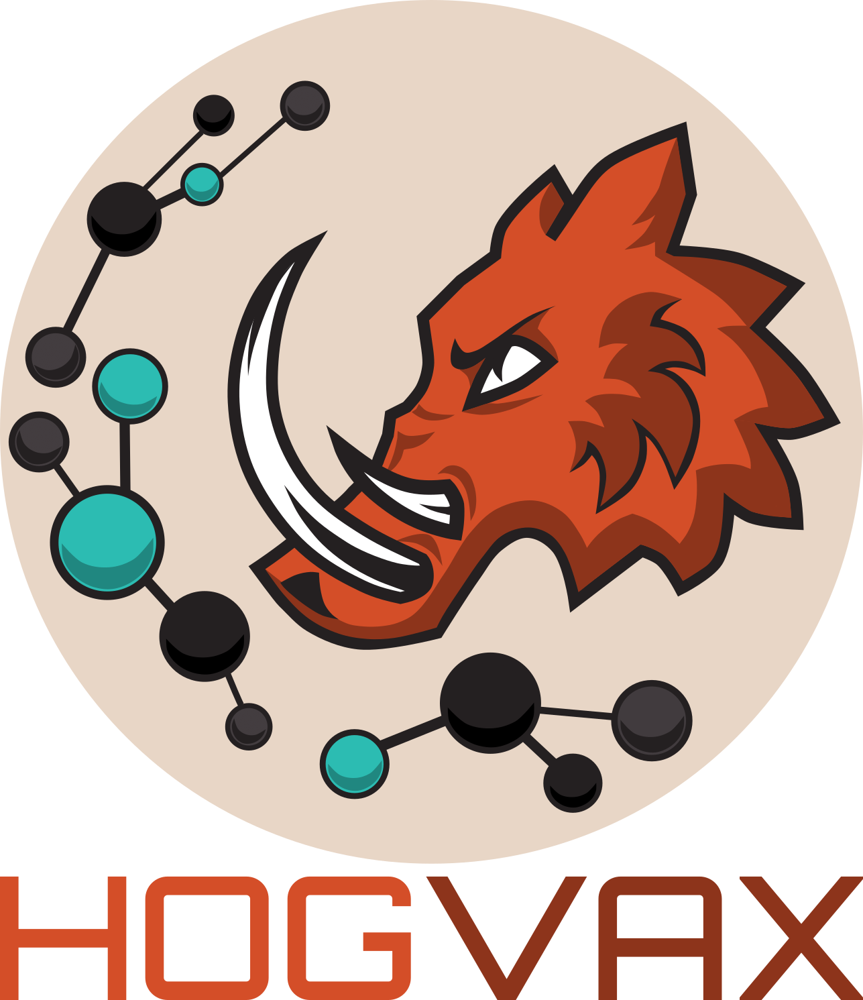

# Abstract
Vaccination is the key component to overcoming the global COVID-19 pandemic. Peptide vaccines present a safe and cost-efficient alternative to traditional vaccines. They are rapidly produced and adapted for new viral variants. The vaccine's efficacy essentially depends on two components: the peptides included in the vaccine and the ability of major histocompatibility complex (MHC) molecules to bind and present these peptides to cells of the immune system. Due to the high diversity of MHC alleles and their diverging specificities in binding peptides, choosing a set of peptides that maximizes population coverage is a challenging task. Further, peptide vaccines are limited in their size allowing only for a small set of peptides to be included. Thus, they might fail to immunize a large part of the human population or protect against upcoming viral variants. Here, we present HOGVAX, a combinatorial optimization approach to select peptides that maximize population coverage. Furthermore, we exploit overlaps between peptide sequences to include a large number of peptides in a limited space and thereby also cover rare MHC alleles. We model this task as a theoretical problem, which we call the *Maximal Scoring k-Superstring Problem*. Additionally, HOGVAX is able to consider haplotype frequencies to take linkage disequilibrium between MHC loci into account. Our vaccine formulations contain significantly more peptides compared to vaccine sequences built from concatenated peptides. We predicted over 98% population coverage for our vaccine candidates of MHC class I and II based on single-allele and haplotype frequencies. Moreover, we predicted high numbers of per-individual presented peptides leading to a robust immunity in the face of new virus variants.

# Execute HOGVAX
HOGVAX uses the Gurobi solver for which a license is required. Further information can be found [here](https://www.gurobi.com/academia/academic-program-and-licenses/). For the use of HOGVAX, we recommend the stand-alone version. The pipeline was used for producing the results of the master thesis. In any case, Conda is required.

## Data
HLA haplotype and allele frequencies, binding affinity predictions, and input peptides are available in [Sciebo](https://uni-duesseldorf.sciebo.de/s/jRTn9Vpff78kLqi) (~2GB). You can use the [download script](download_data.sh) to download and extract the data directly.

## Snakemake Pipeline
The pipeline can be used to execute HOGVAX or the OCG approach. Additionally, the concatenation approach is always executed. Use the the [config file](Pipeline/envs/config.yaml) to adjust parameters for your execution. The pipeline can optionally be used for regional context embedding computations. Open a shell in the [Pipeline](Pipeline/) directory and execute the pipeline after adjusting the config file as follows:

```shell
snakemake --cores <cpu cores> --use-conda
```

In your specified output directory, you can find the computed vaccine sequences and chosen peptides in `ilp/pep_out/`.

## Stand-alone Version
Open a shell in the [HOGVAX](HOGVAX/) folder and create the conda environment from the `yaml` file for proper execution of HOGVAX.

```shell
conda env create -f hogvax_env.yaml
conda activate hogvax_env
```

To execute HOGVAX, call the python script with the necessary arguments, see the [example arguments](HOGVAX/example_arguments.txt).

```shell
python hogvax.py <arguments>
```
